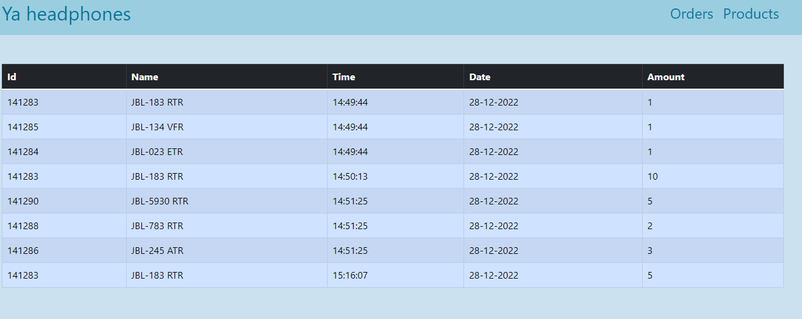
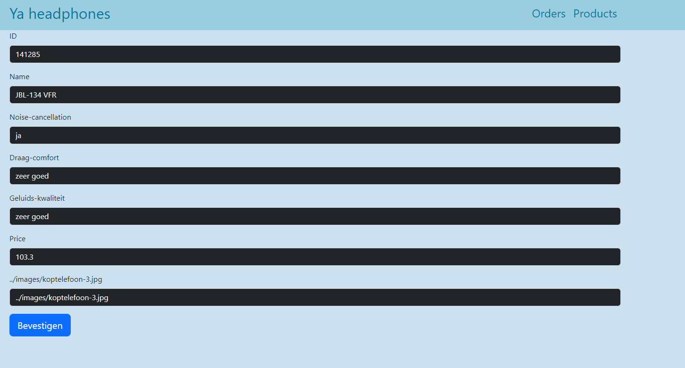

# ya-headphones

## Over het website
Ik ga een webshop maken die alleen headphones verkoopt. De website heeft een naam: YA Headphones.
De webshop gaat euro als valuta gebruiken.

## bezoeker gedeelte:

### Home pagina

### Winkelwagen
hier kan bezoeker zijn bestelde headphones daadwerklijk kopen of het aantal wijzigen of verwijderen (van het  winkelwagen).

### all headphones pagina
Hier ziet bezoeker alle headphones

## admin-panel gedeelte

### admin-panel
hier ziet admin overzicht van alle headphones. Hier kan ook admin producten verwijderen, toevoegen en wijzigen.

### voeg headphone toe
hier ziet admin overzicht van alle headphones. Hier kan ook admin producten verwijderen, toevoegen en wijzigen.

### bestellingen overzicht 
hier ziet admin overzicht van bestelde headphones.

### edit product pagina 
hier kan de admin headphone info wijzigen.

## Dit website zal gebruik maken van deze technologies:
1. HTML
2. CSS
3. Javascript
4. Bootstrap 5.2
5. Netfliy
6. Google material icons

## Let op:
Misschien heb je gemerkt dat sommige pagina's zijn anders dan in de planning of in de foto's. Dat komt door op moment dat ik begon met coderen van het website merk ik dat sommige dingen zijn beter op een net andere manier.

